<p align="center">
  
</p>

<h1 align="center">Nautilus ERP</h1>

<p align="center">
  A Clean Architecture ERP for procure-to-pay and order-to-cash — .NET 9 API + React 19 SPA,
  built for Fiji-localized SMEs.
</p>

<p align="center">
  
  
  
  
</p>

<p align="center">
  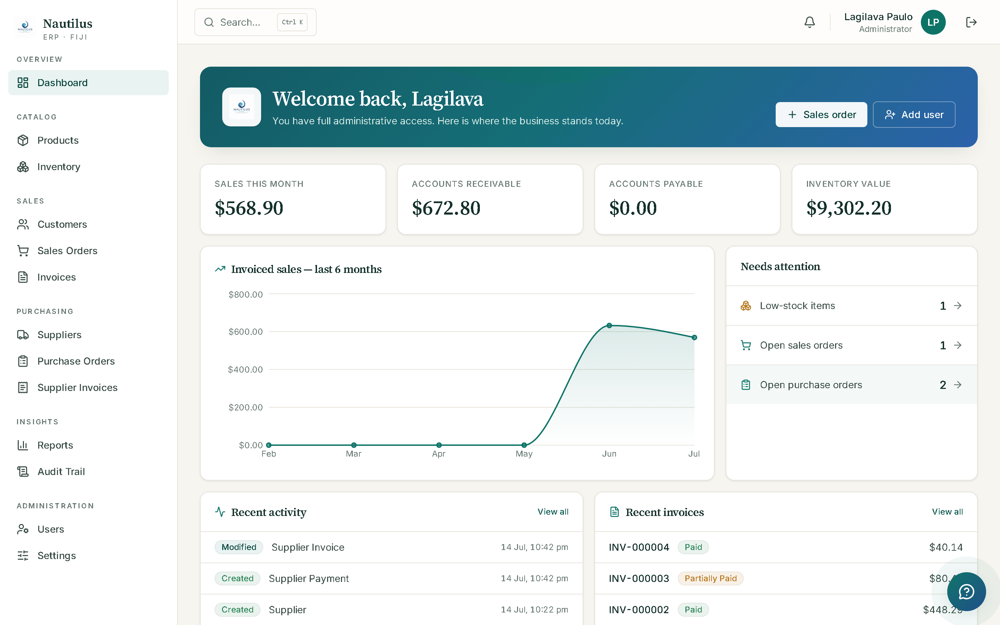
</p>

---

## Contents

- [What this is](#what-this-is)
- [Screenshots](#screenshots)
- [Modules](#modules)
- [Architecture](#architecture)
- [Access control](#access-control)
- [Tech stack](#tech-stack)
- [Getting started](#getting-started)
- [Key workflows](#key-workflows)
- [Project structure](#project-structure)
- [API surface](#api-surface)
- [Testing](#testing)
- [Deployment](#deployment)
- [Documentation](#documentation)

## What this is

Nautilus ERP is a staff-facing business management system covering **inventory, sales,
purchasing, and reporting**, with audit logging, real-time notifications, and role +
branch + segregation-of-duties access control baked in from the domain layer up.
Customers never log in — it's an internal system of record for the people running the
business.

The backend is a **Clean Architecture** .NET 9 solution (CQRS via MediatR); the frontend
is a **React 19 + TypeScript** SPA (Vite, TanStack Query, Tailwind).

## Screenshots

<p align="center">
  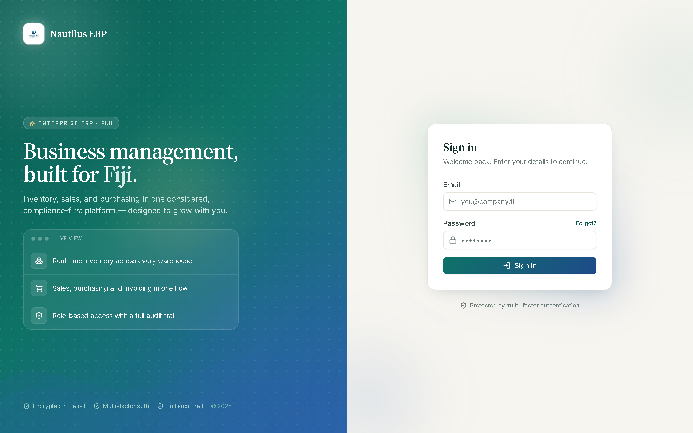
  <br/><sub>Login</sub>
</p>
<p align="center">
  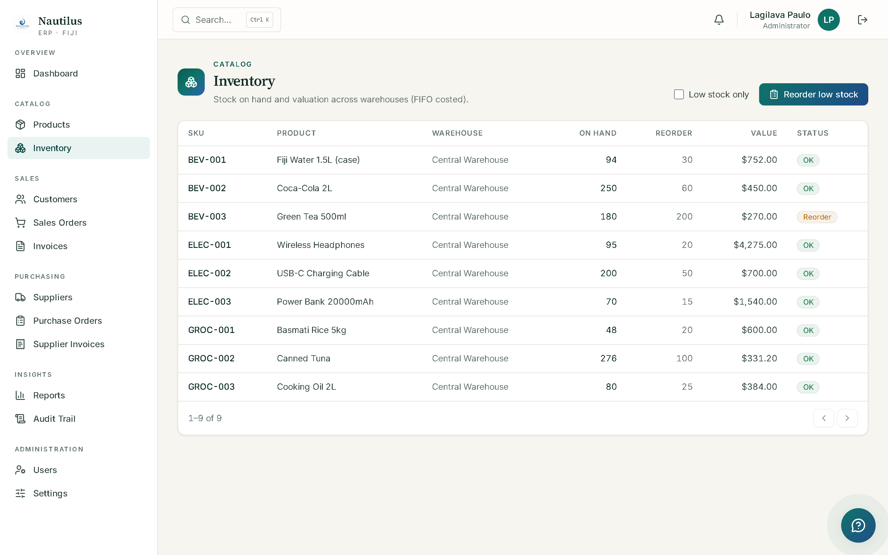
  <br/><sub>Inventory — FIFO-costed stock on hand, with one-click reorder</sub>
</p>
<p align="center">
  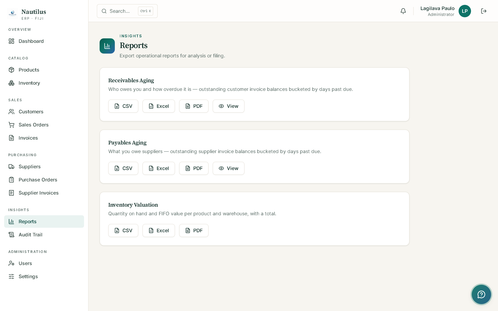
  <br/><sub>Reports — aging and valuation exports (CSV/Excel/PDF)</sub>
</p>

## Modules

| # | Module | Highlights |
|---|--------|-----------|
| M1 | Scaffold | Solution layout, DI, Serilog, health checks |
| M2 | Auth | JWT + rotating refresh tokens, lockout, MFA (TOTP), login history |
| M3 | Reference data | Products, effective-dated taxes, org units, catalog |
| M4 | Inventory | FIFO costing layers, stock ledger, valuation |
| M5 | Sales | Customers, order & invoice state machines, payments, fiscalization port |
| M6 | Purchasing | Suppliers, PO state machine, goods receipt → FIFO stock, supplier invoices/payments |
| M7 | Audit logging | `SaveChanges` interceptor → `AuditLogs`, admin-only trail |
| M8 | Dashboard & reporting | KPIs, aging reports, CSV/Excel/PDF export |
| M9 | Notifications | SignalR live updates + Hangfire email queue |
| M10 | React SPA | Auth, dashboard, catalog, order-to-cash, procure-to-pay, admin, command palette, AI assistant |

<p align="center">
  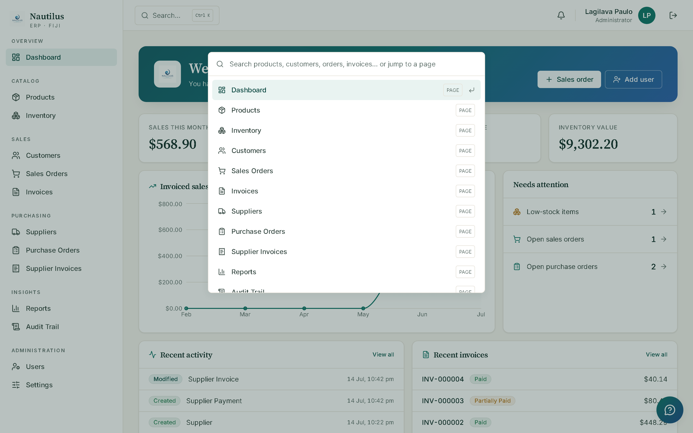
  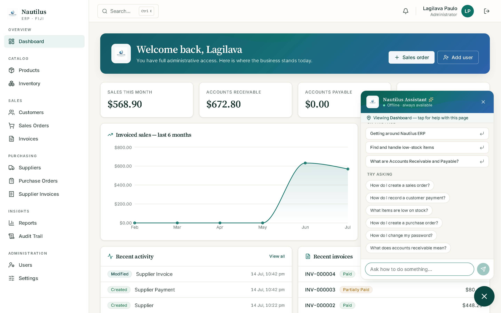
</p>
| M11 | Hardening | Rate limiting, response compression, security headers, DB health checks, Docker |

## Architecture

Dependencies point strictly inward — the Domain has zero knowledge of frameworks,
persistence, or transport.

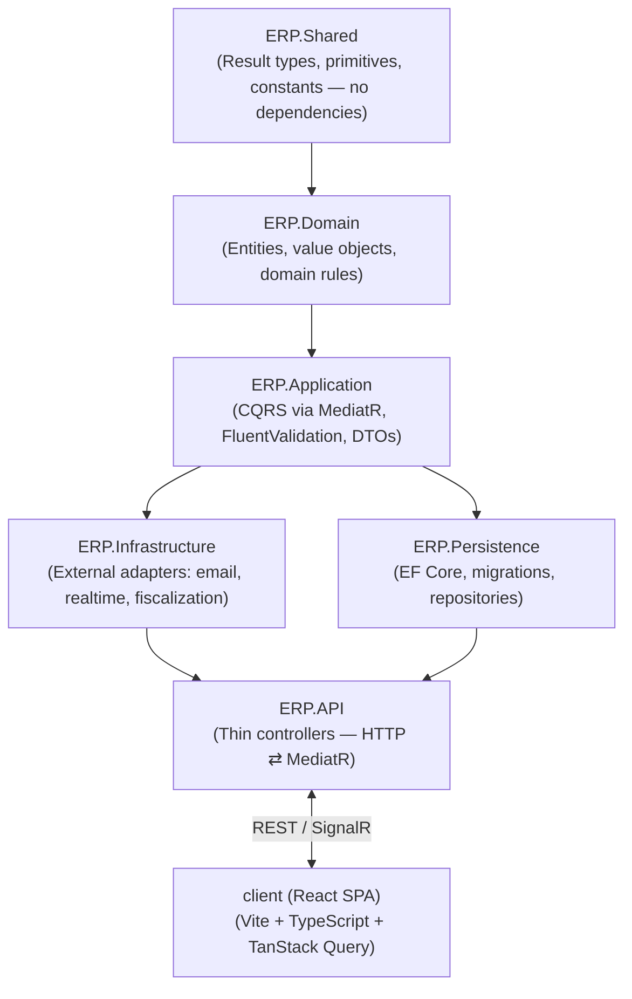

**Enforced rules**
- Dependency direction is asserted by `ArchitectureSanityTests` (`ERP.UnitTests`) — the
  Domain assembly must never reference Application/Infrastructure/Persistence.
- Controllers are thin: HTTP translation only, no business logic, no `DbContext`.
- Entities are persistence-ignorant: no EF attributes; mapping lives in
  `IEntityTypeConfiguration<T>` classes in `ERP.Persistence`.

## Access control

Three layers, applied in order on every request:

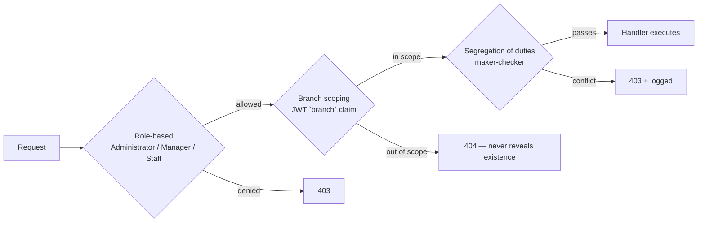

**Segregation of duties** on the procure-to-pay chain — no single person can both create
and approve the same document:

| Rule | The actor may not be… |
|---|---|
| `PurchaseOrderApproval` | the person who raised the order |
| `GoodsReceipt` | the raiser or the approver of the order |
| `SupplierInvoiceApproval` | the person who entered the bill, or who received the goods |
| `SupplierPayment` | the person who approved the bill |
| `InvoiceVoid` | the person who issued the invoice |
| `SupplierInvoiceCancel` | the person who entered a bill someone else approved |

Individual rules (or all of them) can be relaxed for small teams via
`"Sod": { "Enabled": true, "DisabledRules": ["SupplierPayment"] }`.

## Tech stack

| Layer | Technology |
|---|---|
| Backend | .NET 9, ASP.NET Core Web API, MediatR (CQRS), FluentValidation, EF Core |
| Database | SQL Server (prod) / SQLite (local dev, zero-infra) |
| Cache / queues | Redis, Hangfire |
| Realtime | SignalR |
| Auth | JWT bearer, rotating refresh tokens, TOTP MFA |
| Observability | Serilog, Sentry, `/health` checks |
| Frontend | React 19, TypeScript, Vite, TanStack Query, React Hook Form + Zod, Tailwind CSS, Recharts |
| Testing | xUnit (`ERP.UnitTests`, `ERP.IntegrationTests`), Vitest + React Testing Library |
| Infra | Docker Compose (SQL Server + Redis), Render (`render.yaml`) |

## Getting started

### Prerequisites
- .NET SDK 9.0 (`dotnet --version` → `9.0.x`)
- Node.js 20+
- Docker Desktop (optional — only needed for SQL Server + Redis or containerized runs)

### Fastest path (Windows, no Docker)

```
run-dev.bat
```

Opens the API and the SPA in separate terminals and launches the browser. Locally the API
uses **SQLite** (`Database:Provider = Sqlite` in `appsettings.Development.json`) — the
schema is created from the model on first run and an admin account is seeded automatically.
No SQL Server required.

### Manual steps

```bash
# backend — http://localhost:5126
dotnet run --project src/ERP.API

# frontend — http://localhost:5173
cd client
npm install
npm run dev
```

Swagger UI: `https://localhost:<port>/swagger` (Development only).

### Demo accounts (Development only)

| Account | Password | Role |
|---|---|---|
| `admin@erp.local` | `Admin#12345` | Administrator |
| `manager@erp.local` | `Demo#12345` | Manager |
| `staff@erp.local` | `Demo#12345` | Staff |

> Use two different accounts to walk the purchasing flow — segregation of duties rejects
> an approval by the same person who raised the order.

### With Docker (SQL Server + Redis)

```bash
docker compose up -d        # starts erp-sqlserver (1433) and erp-redis (6379)
docker compose ps           # check health
dotnet run --project src/ERP.API
```

## Key workflows

### Procure-to-pay

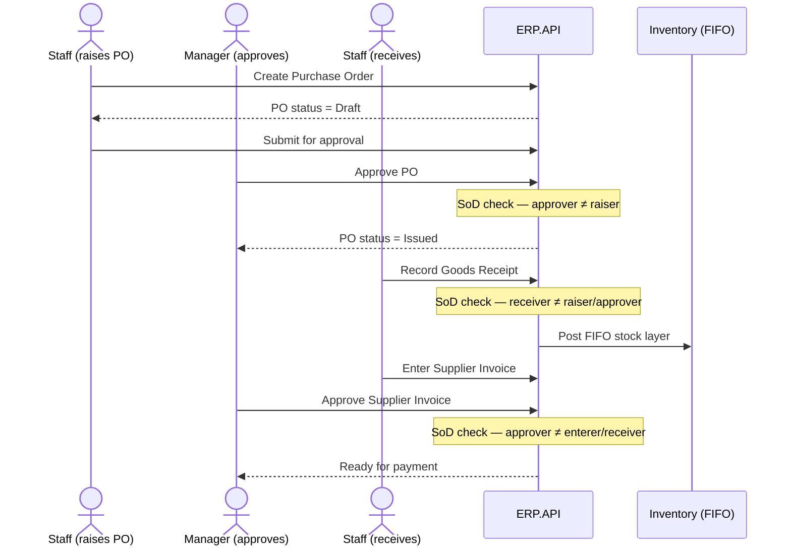

<p align="center">
  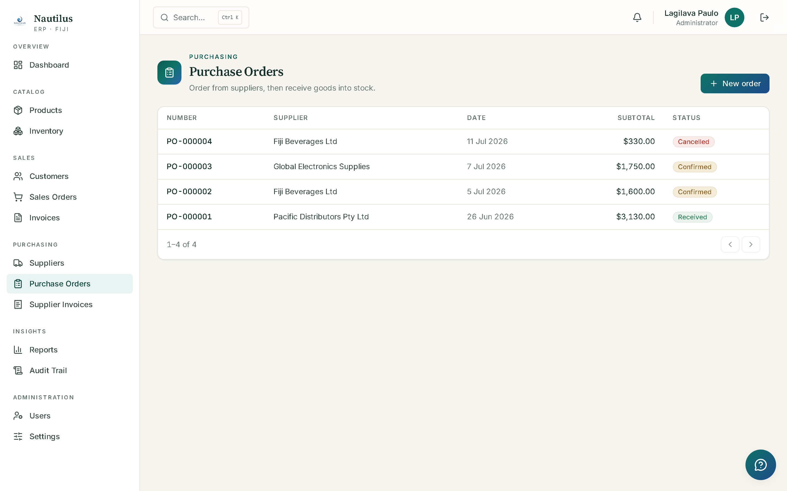
</p>

### Order-to-cash

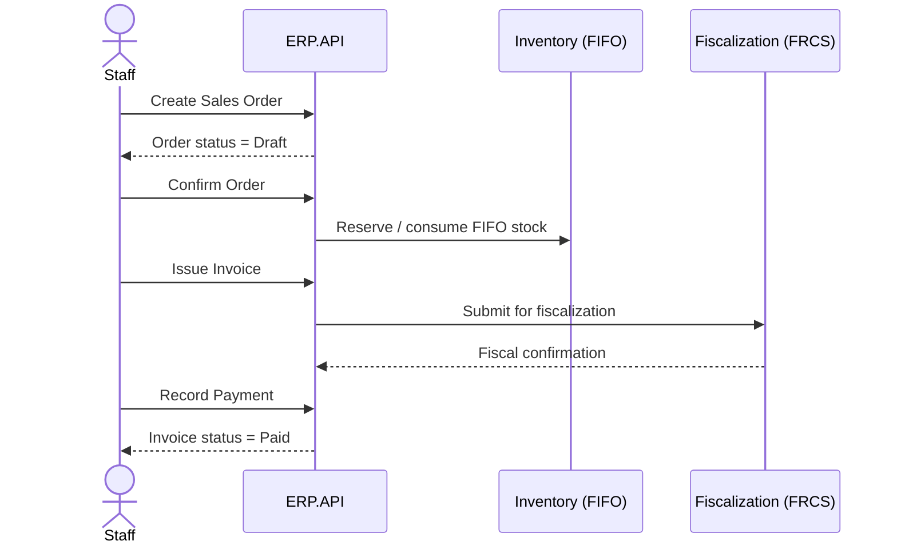

<p align="center">
  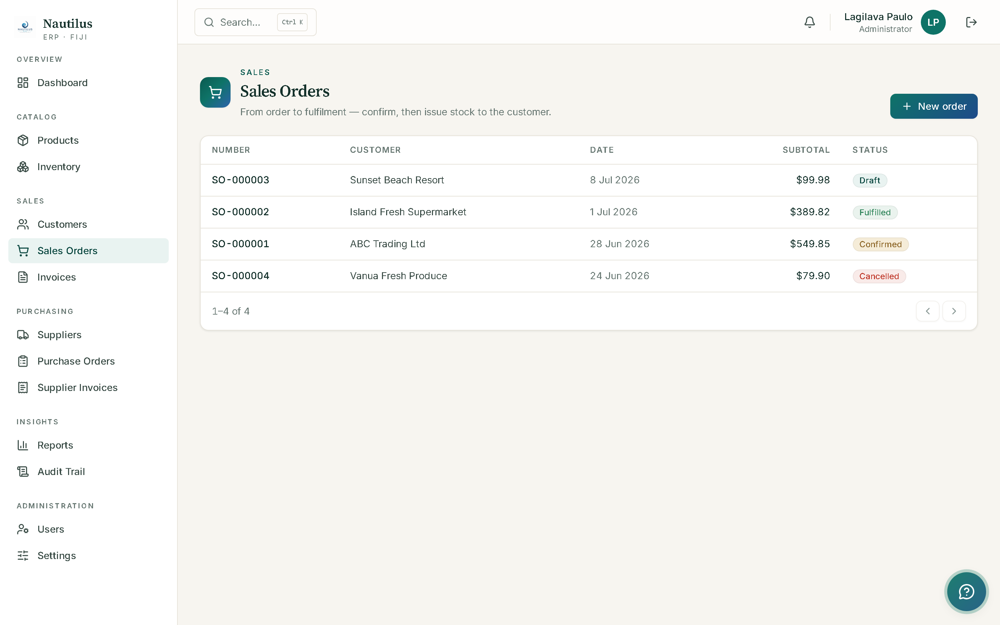
</p>

### Request lifecycle (SPA ⇄ API)

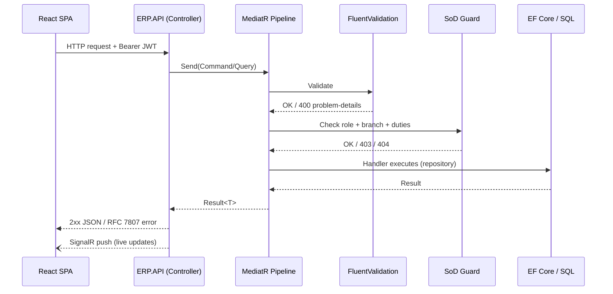

## Project structure

```
.
├── src/
│   ├── ERP.Shared/                    # Result types, primitives — no dependencies
│   ├── ERP.Domain/                    # Entities, value objects, domain rules
│   ├── ERP.Application/               # CQRS handlers, validators, DTOs (by feature)
│   │   └── Features/
│   │       ├── Auth/  Catalog/  Inventory/  Sales/  Purchasing/
│   │       ├── Reports/  Search/  Admin/  Organization/  Auditing/  Documents/
│   ├── ERP.Infrastructure/            # Email, realtime, fiscalization adapters
│   ├── ERP.Persistence/               # EF Core DbContext, configurations, migrations
│   ├── ERP.Persistence.Migrations.Postgres/
│   └── ERP.API/                       # Controllers, Program.cs, middleware
├── client/
│   └── src/
│       ├── app/            # App shell, routing
│       ├── auth/           # AuthContext, login/session
│       ├── pages/          # Feature pages (sales, purchasing, admin, reports…)
│       ├── components/     # Shared UI (design system, command palette)
│       └── assistant/      # AI assistant integration
├── tests/
│   ├── ERP.UnitTests/
│   └── ERP.IntegrationTests/
├── docs/                               # Deep-dive docs (see below)
├── docker-compose.yml                  # SQL Server + Redis for local dev
├── render.yaml                         # Render.com deployment config
└── run-dev.bat                         # One-click local dev launcher (Windows)
```

## API surface

REST, JSON, RFC 7807 problem-details on error. Highlights:

- **Auth** — `POST /api/auth/login`, `/refresh`, `/mfa/verify`, `/mfa/setup`, `/logout`
- **Catalog** — `/api/products`, `/api/categories`, `/api/units-of-measure`, `/api/taxes`
- **Inventory** — `/api/inventory` (stock levels, FIFO layers, adjustments)
- **Sales** — `/api/sales-orders`, `/api/invoices`, `/api/customers`
- **Purchasing** — `/api/purchase-orders`, `/api/supplier-invoices`, `/api/suppliers`
- **Reporting** — `/api/reports` (dashboard KPIs, aging, CSV/Excel/PDF export)
- **Admin** — `/api/users`, `/api/branches`, `/api/warehouses`, `/api/audit-logs`
- **Search** — `/api/search` (global command-palette search)
- `GET /health` — liveness/readiness probe
- `GET /swagger` — interactive OpenAPI UI (Development only)

Conventions: enums serialize as strings, list endpoints are paginated
(`{ items, page, pageSize, totalCount, totalPages }`), `DateOnly` fields are ISO dates,
CORS allows `http://localhost:5173`/`:3000` by default. Full reference: [docs/API.md](docs/API.md).

## Testing

```bash
# backend
dotnet test ERP.sln

# frontend
cd client
npm test
```

- `ERP.UnitTests` — domain rules, handlers, architecture sanity tests
- `ERP.IntegrationTests` — end-to-end through the API pipeline
- `client` — Vitest + React Testing Library, covering auth, forms, and detail pages

## Deployment

- **Docker Compose** — local SQL Server + Redis (`docker-compose.yml`)
- **Render** — `render.yaml` defines the hosted deployment
- Provider switch: `Database:Provider` = `Sqlite` (local) or `SqlServer` (staging/prod)
- Secrets (JWT signing key, connection strings, SMTP, Sentry DSN) are supplied via
  environment variables / user-secrets — never committed

Full walkthrough: [docs/Deployment.md](docs/Deployment.md).

## Documentation

| Doc | Covers |
|---|---|
| [docs/Architecture.md](docs/Architecture.md) | Layering, access control, module status |
| [docs/API.md](docs/API.md) | Full endpoint reference and conventions |
| [docs/Database.md](docs/Database.md) | Schema, FIFO costing, migrations |
| [docs/Deployment.md](docs/Deployment.md) | Local dev, Docker, hosted deployment |
| [docs/DeveloperGuide.md](docs/DeveloperGuide.md) | Contribution workflow, conventions |
| [docs/UserManual.md](docs/UserManual.md) | End-user walkthroughs by role |
| [erp-claude-code-prompt.md](erp-claude-code-prompt.md) | Original spec, incl. Fiji fiscalization requirements |

---

<p align="center"><sub>Built with .NET 9 and React 19 · Fiji-localized business management</sub></p>
